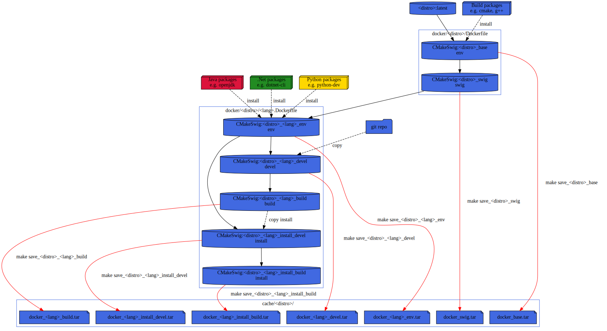

# CI: Makefile/Docker testing

To test the build on various distro, I'm using docker containers and a Makefile for orchestration.

pros:
* You are independent of third party CI runner VM images (e.g. [github actions/virtual-environments](https://github.com/actions/virtual-environments)).
* You can run it locally on any host having a linux docker image support.
* Most CI provide runner with docker and Makefile installed.

cons:
* Only GNU/Linux distro supported.
* Could take few GiB (~30 GiB for all distro and all languages)
  * ~500MiB OS + C++/CMake tools,
  * ~150 MiB Python,
  * ~400 MiB dotnet-sdk,
  * ~400 MiB java-jdk.

## Usage

To get the help simply type:
```sh
make
```

note: you can also use from top directory
```sh
make --directory=ci
```

### Example
For example to test `Python` inside an `Alpine` container:
```sh
make alpine_python_test
```

## Docker layers

Dockerfile is splitted in several stages.



### Run arm64v8 image on amd64 machine
You can build and run `arm64v8` (i.e. `aarch64`) docker container on a `amd64` host (`x86_64`) by enabling qemu support:
```sh
docker run --rm --privileged multiarch/qemu-user-static --reset -p yes
```
ref: https://github.com/multiarch/qemu-user-static#getting-started

Then you should be able to run them, e.g.:
```sh
docker run --rm -it arm64v8/ubuntu
```
ref: https://github.com/docker-library/official-images#architectures-other-than-amd64

### Docker buildx
ref: https://docs.docker.com/buildx/working-with-buildx/

On you enable qemu support (see above), you can list available platform using:
```sh
docker buildx ls
```
Then you can build a docker image using one of the available platform
```sh
docker buildx build --platform linux/arm64 ...
```

## Custom CMake install

To control the version of CMake, instead of using the
[version provided by the distro package manager](https://repology.org/project/cmake/badges), you can:
* Install the prebuilt binaries (recommanded) 
* Build it from source (slower)
* Install it using the [pypi package cmake](https://pypi.org/project/cmake/) (need a python stack)

### Install prebuilt
The recommended and faster way is to use the prebuilt version:
```Dockerfile
# Install CMake 3.21.4
RUN wget "https://cmake.org/files/v3.21/cmake-3.21.4-linux-x86_64.sh" \
&& chmod a+x cmake-3.21.4-linux-x86_64.sh \
&& ./cmake-3.21.4-linux-x86_64.sh --prefix=/usr/local/ --skip-license \
&& rm cmake-3.21.4-linux-x86_64.sh
```

**warning**: Since [CMake 3.20](https://cmake.org/files/v3.20/) Kitware use a lowercase `linux` instead of `Linux`.

### Build from source
To build from source you can use the following snippet:
```Dockerfile
# Install CMake 3.21.4
RUN wget "https://cmake.org/files/v3.21/cmake-3.21.4.tar.gz" \
&& tar xzf cmake-3.21.4.tar.gz \
&& rm cmake-3.21.4.tar.gz \
&& cd cmake-3.21.4 \
&& ./bootstrap --prefix=/usr/local/ \
&& make \
&& make install \
&& cd .. \
&& rm -rf cmake-3.21.4
```

